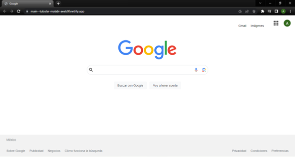

# CLON DE GOOGLE (HTML, CSS)

Proyecto realizado con la intención de aplicar los conocimientos obtenidos en el bootcamp de Tecnolochicas PRO Summer Camp.

Puedes poner en práctica tus habilidades revisando y utilizando el código a continuación.

## ÍNDICE

* [1. INTRO](https://github.com/Andrea-P01/clon-de-google/blob/main/README.md#1intro)
* [2. DEMO](https://github.com/Andrea-P01/clon-de-google/blob/main/README.md#2-demo)
* [3. ¿QUÉ CONSTRUIRÁS?](https://github.com/Andrea-P01/clon-de-google/blob/main/README.md#3-qu%C3%A9-construir%C3%A1s)
* [4. OBJETIVOS DE APRENDIZAJE](https://github.com/Andrea-P01/clon-de-google/blob/main/README.md#4-objetivos-de-aprendizaje)
* [5. REQUISITOS](https://github.com/Andrea-P01/clon-de-google/blob/main/README.md#5-requisitos)

****

## 1.INTRO

HTML trabaja de la mano con CSS para crear las páginas web que usamos todos los días en el navegador💻. Incluso, este sitio web en donde estás viendo este contenido está construido con HTML y CSS🤯 (junto con otros elementos que conocerás más adelante). Para este primer proyecto, con los conocimientos que tienes de HTML y CSS realizarás la clonación de la interfaz de Google, sí, esa que ves cada que haces una búsqueda en su navegador, ¿aceptas el reto🤓?

## 2. DEMO
Puedes entrar a ver el demo en este vínculo: https://main--tubular-malabi-aeeb0f.netlify.app/

La idea es inspirarte con esta demostración de proyecto. 

**Probablemente no te quede 100% idéntico, pero puedes darle tu propio estilo 😎**, conoce, aprende y diseña futuro (a) programador (a), enséñale al mundo real tu mundo digital. 🌍💻

## 3. ¿QUÉ CONSTRUIRÁS?

Este proyecto está enfocado en construir la interfaz estática de Google.

Se te pide que sea una sola página que contenga las secciones siguientes:
  - **a. Header**
    Sección que involucra la foto del perfil, iconos, logo de Google y las áreas principales del sitio.
  - **b. Main**
    Sección del contenedor para los elementos centrales de la página. 
  - **c. Footer**
    Sección que incluye hipervínculos al final de la página.

****

## 4. OBJETIVOS DE APRENDIZAJE

El objetivo principal de este proyecto es desarrollar una interfaz utilizando HTML y CSS, en toda su aplicación.

Aplicarás:

- Etiquetas estándar HTML5.
- Estilos con CSS

## 5. REQUISITOS

Usa esta lista para saber los requisitos mínimos del proyecto:

### GENERAL

Realizarse de manera individual

### UI
- [ ] Aplicar en todo el sitio HTML semántico de estándar no.5 (HTML5).
- [ ] Aplicar tipos de selectores en CSS.
- [ ] Sección `Header`, `main`, `footer`

¡ÉXITO!❤